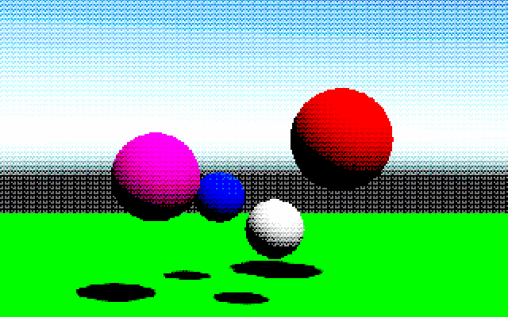

# cripsy-and-unity
Small postprocessing experiment on obtaining vintage and retro rendering in Unity. Also it's gonna be crispy!

# Base idea
## Pixelization
The most important thing is resolution. Screens we have today are simply too big to display small 320x200 games as Full HD. Getting small resolution on big screen can be problematic, but it is doable. In Unity there is a popular script that does that: PixelBoy. (https://gist.github.com/nothke/e68576aeca5ca6279343f8cd1e0d42ca)

Copying bigger texture onto smaller and smaller onto bigger does the job.

Next step is to use shaders to process the product of our rendering. In this case we use fragment shaders (Sampler2D -> Sampler2D).


## Dithering

A hard one indeed to use on particular object, but easy enough to be applied globally on 2D texture.

This is the best tutorial on this topic:

https://www.ronja-tutorials.com/2019/05/11/dithering.html

In my case I have only a 2D Texture to postprocess, so I apply a repetitive "pattern" of pixels that blends slightly with rendered texture. This generates some blended colors that will be eliminated by Color Palettes, or they will remain... and form some kind of dithering.

Downside? Everything gets dithered.

## Color Palettes
Our world is full of colors. Our screens can show more than 16 milion colors because we use 8 bits for each color (R, G, B). If we used less bits, we could get different palette of colors. To scale float representation of color in GLSL to some different palette I use:

```col.r = (float)((int)(col.r * _PaletteSize) % (_PaletteSize+1)) / (float)(_PaletteSize);```

For red... and for other colors too!

This is relatively simple solution, especially if we don't have predefined palette. I also multiply formula above by some float to achieve tint.

## Some examples


Lower resolution and smaller palette.



Higher resolution, large palette and global color tint.


